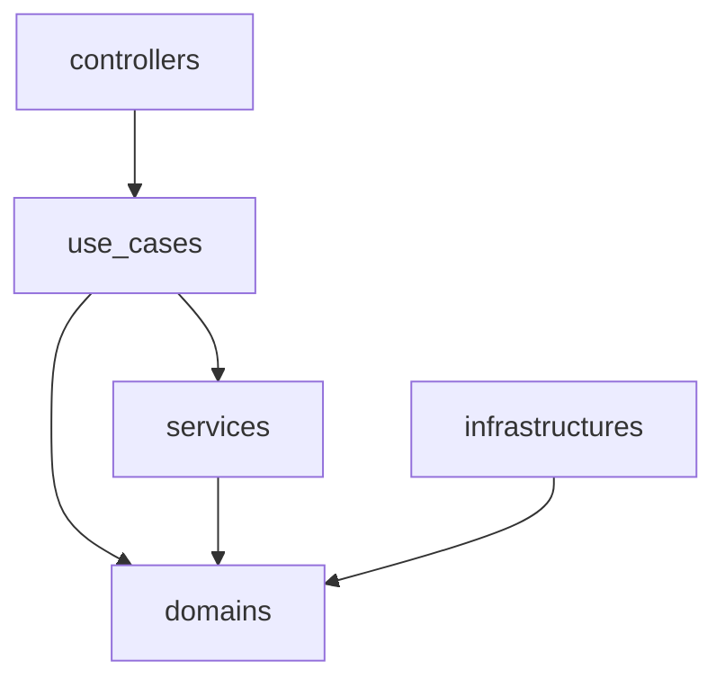
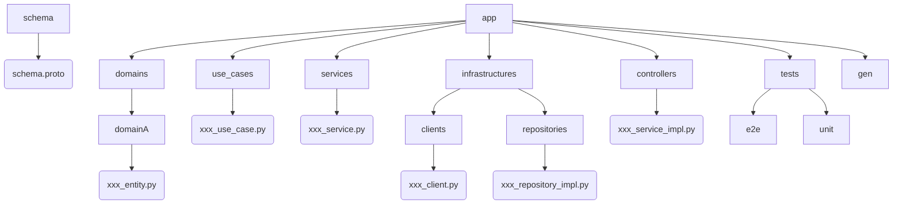

# Design Doc

このドキュメントは、プロジェクトの設計に関する情報を提供する。

## アーキテクチャ

基本的には、DDD+クリーンアーキテクチャを採用

- controllers: コントローラ層 (gRPCのserviceを定義)
- use_cases: ユースケース層 (一つのユースケースを実現するためのビジネスロジック)
- domains: ドメイン層 (ドメインモデル、エンティティ、バリューオブジェクト、リポジトリ)
- services: サービス層 (ドメインサービス)
- infrastructures: インフラ層 (データベース、外部API、ファイルシステムなどのインフラストラクチャ)

## ディレクトリ構成

